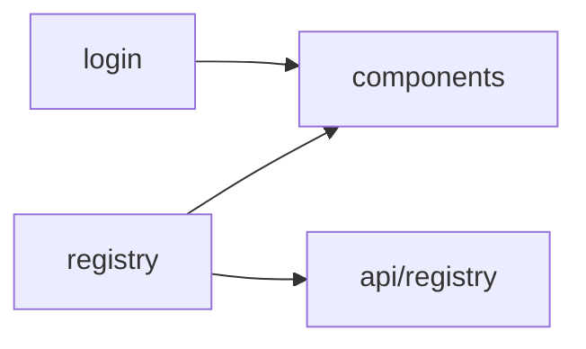

# Module Mapping Skill

项目功能模块图谱分析技能，用于识别项目模块划分并生成依赖关系图。

> ⚠️ 本技能为"指令层可执行"，即 AI 读取后按流程调用脚本，非平台自动编排执行。

## Intent

Use this skill when the user asks to:
- 查看项目有哪些功能模块
- 分析模块依赖关系
- 生成模块图谱
- 了解项目结构划分

This skill invokes:
- **本地脚本**: `.codebuddy/scripts/module-mapper.js`

## Workflow

### Step 1: Confirm Target
Ask user for project path if not provided:
```
请确认要分析的项目路径：
1. 使用当前目录
2. 指定其他路径
```

### Step 2: Run Analysis

**快速概览（推荐）**
```bash
node .codebuddy/scripts/module-mapper.js . --mode summary
```

**完整分析（含依赖图）**
```bash
node .codebuddy/scripts/module-mapper.js . --mode full
```

**仅生成图表**
```bash
node .codebuddy/scripts/module-mapper.js . --mode graph --output mermaid
```

### Step 3: Format Report
Use the output template below to present results.

### Step 4: Provide Advice
Based on analysis, recommend next steps:
- 健康度低的模块建议重构
- 循环依赖需要解耦
- 孤立模块检查是否废弃

## Tool Integration

| 工具类型 | 路径/名称 | 适用场景 |
|---------|----------|---------|
| 本地脚本 | `.codebuddy/scripts/module-mapper.js` | 无需 MCP，直接执行 |

## Output Modes

| 模式 | 说明 | Token 消耗 |
|------|------|-----------|
| `summary` | 模块列表 + 统计信息 | 低 |
| `full` | 含依赖图 + 模块详情 | 中 |
| `graph` | 仅 Mermaid 图表 | 低 |

## Required Output Template

```markdown
## 项目功能模块图谱

### 1. 摘要统计
- **总模块数**: X
- **总文件数**: X
- **总代码行数**: X
- **平均健康度**: X/100

### 2. 模块概览
| 模块 | 类型 | 入口数 | 文件数 | 行数 | 健康度 |
|------|------|--------|--------|------|--------|
| views/registry | page | 5 | 23 | 8,420 | 🔴 45/100 |
| views/login | page | 2 | 8 | 1,560 | 🟢 72/100 |

### 3. 模块依赖图


### 4. 模块详情
#### 📦 views/registry
- **类型**: page
- **健康度**: 45/100
- **子模块**: selfSign, fillInfo, openAccount
- **依赖**: @/components, @/api/registry
- **问题**:
  - 🔴 存在超大文件（1452 行）
  - 🟡 模块代码行数超过阈值
```

## References

- [Vue 模块识别模式](references/vue-module-patterns.md)
- [依赖分析方法](references/dependency-analysis.md)

## Related

- **Skill**: `structure-review` - 结构健康度审查
- **Agent**: `structure-analyzer` - 完整结构分析 Agent
- **Rule**: `layer1_base/architecture/feature-based-structure.md` - 架构规范

---

💡 **快速导航**:
- 想查看结构健康度？→ 输入 "结构分析"
- 想重构某个模块？→ 输入 "重构 [模块名] 模块"
- 想分析具体文件？→ 输入 "分析 xxx.vue"
