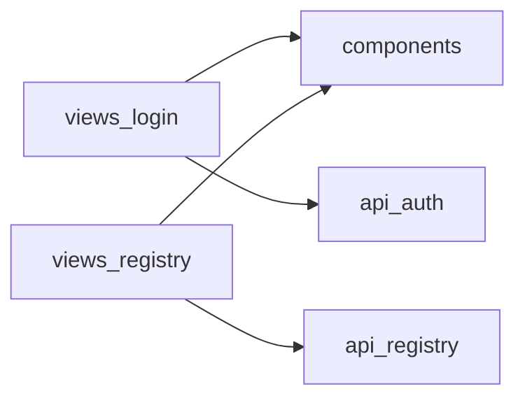

# 依赖分析方法

本文档说明模块依赖分析的实现原理和最佳实践。

## 依赖类型

| 类型 | 说明 | 示例 |
|------|------|------|
| `import` | 静态导入 | `import { foo } from '@/utils'` |
| `dynamic` | 动态导入 | `const Foo = () => import('@/views/Foo.vue')` |
| `lazy` | 懒加载 | `defineAsyncComponent(() => import(...))` |

## 依赖识别规则

### 1. 内部依赖

识别项目内模块间的引用关系：

```typescript
// 绝对路径引用（推荐）
import { api } from '@/api/user'        // → api/user
import { Button } from '@/components'    // → components

// 相对路径引用
import { helper } from '../utils/helper' // 需要路径解析
```

**识别逻辑**：
1. 以 `@/` 或 `~/` 开头 → 内部依赖
2. 以 `.` 开头 → 相对引用，需要解析实际路径
3. 其他 → 外部依赖

### 2. 外部依赖

识别 npm 包依赖：

```typescript
import { ref } from 'vue'           // → vue（框架，忽略）
import axios from 'axios'           // → axios
import { ElButton } from 'element-plus' // → element-plus
```

## 依赖图构建

### 数据结构

```typescript
interface DependencyGraph {
  nodes: string[];        // 模块列表
  edges: DependencyEdge[]; // 依赖边
}

interface DependencyEdge {
  from: string;   // 来源模块
  to: string;     // 目标模块
  type: 'import' | 'dynamic' | 'lazy';
  count: number;  // 引用次数
}
```

### 构建流程

```
1. 扫描所有模块
   ↓
2. 解析每个文件的 import 语句
   ↓
3. 将 import 路径映射为模块名
   ↓
4. 构建边列表（去重、计数）
   ↓
5. 输出依赖图
```

## 问题检测

### 1. 循环依赖检测

使用 DFS 检测图中的环：

```
A → B → C → A  // 发现循环
```

**解决方案**：
- 提取公共逻辑到新模块
- 使用依赖注入解耦
- 延迟加载打破循环

### 2. 高耦合检测

```
模块 A 依赖 15 个其他模块  // 依赖过多
模块 B 被 25 个模块引用    // 被依赖过多
```

**阈值设置**：
- `maxDependencies`: 10（单个模块最大依赖数）
- `maxDependents`: 20（单个模块最大被依赖数）

### 3. 孤立模块检测

```
模块 X 无任何依赖，也不被任何模块引用
→ 可能是废弃代码
```

## Mermaid 图表生成

### 基础格式



### 样式定义

```mermaid
classDef page fill:#e1f5fe,stroke:#01579b
classDef feature fill:#f3e5f5,stroke:#4a148c
classDef shared fill:#e8f5e9,stroke:#1b5e20
classDef api fill:#fce4ec,stroke:#880e4f
```

### 边粗细

- 普通依赖（1-3次引用）：`-->`
- 强依赖（>3次引用）：`==>`

## 最佳实践

### 1. 单向依赖原则

```
✅ 正确：page → feature → shared → util
❌ 错误：shared → page（下层依赖上层）
```

### 2. 最小依赖原则

```
✅ 每个模块只依赖必要的模块
❌ 模块依赖过多其他模块
```

### 3. 接口隔离原则

```
✅ 通过 index.ts 导出公共 API
❌ 直接引用模块内部文件
```

## 与其他工具配合

| 工具 | 用途 |
|------|------|
| `madge` | 生成依赖图可视化 |
| `dependency-cruiser` | 依赖规则校验 |
| `webpack-bundle-analyzer` | 包大小分析 |
